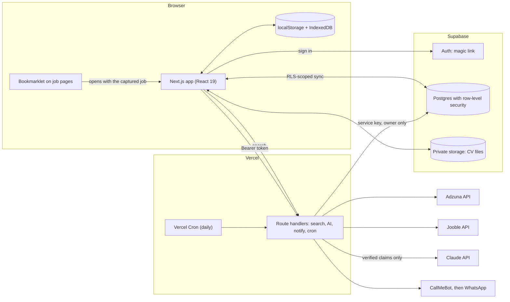

# FireHunt

A job-application tracker for a multi-region job hunt (the Gulf, Australia, Singapore and Europe), with cross-device cloud sync, AI-assisted capture and CV matching, and WhatsApp reminders.

**Live app:** https://firehunt.vercel.app &nbsp;·&nbsp; **Try it without signing in:** https://firehunt.vercel.app/?demo=1

The demo uses fictional sample data, saves nothing, and shows a canned AI analysis, so it costs nothing to run.

> **AI status:** live AI is switched **off** on the hosted site for now. It needs a paid Anthropic API key, which I haven't funded, so the AI buttons are hidden for signed-in users and the demo shows a sample analysis instead. Everything else is live. The AI code is complete and tested (see [Testing](#testing)); setting `ANTHROPIC_API_KEY` switches it on.

## Why it exists

Applying across several countries means tracking dozens of roles from different sites, remembering which CV went where, and noticing when a follow-up is overdue. Easy-Apply buttons also bury you in a pile of applicants; the better move is to message the recruiter directly. FireHunt is built around that: it captures a job from any page, pulls out the recruiter's contact details, and helps you write a personal message to them.

## What it does

- **Kanban pipeline** (Interested → Applied → Interview → Offer → Rejected) with filters, notes, deadlines and follow-up dates, colour-coded by urgency.
- **Job search** across two commercial APIs: Adzuna (Australia, Singapore, the Netherlands, Western Europe) and Jooble (the six Gulf states, with an "All Gulf" option that searches them in parallel and de-duplicates). 30 results per page.
- **One-click capture** from any job page with a bookmarklet. It reads `JobPosting` structured data when a site provides it, and has special handling for LinkedIn, which exposes almost nothing to scripts.
- **Recruiter contacts** pulled out of the posting, shown as click-to-copy chips with the person's name when the text makes it clear.
- **CV manager**: upload PDF or Word CVs, tag them by role, attach one to each job.
- **Cross-device sync**: passwordless sign-in; jobs and CV files follow you between devices.
- **Dashboard**: stage counts, funnel bar, response rate.
- **WhatsApp digest** every morning (and on demand): saved jobs, follow-ups due, deadlines bucketed by week.
- **Backup**: export and import everything as JSON.

### AI features

| Feature | What it does |
|---|---|
| **Analyze fit** | Compares an attached CV with a posting: a score, where you match (each with a quote from your CV), honest gaps, CV bullets reworded for the role, and an outreach draft for email or WhatsApp. |
| **Capture cleanup** | When a captured job comes in, the model extracts title, company, country, salary, closing date and named contacts. |

**The model is never trusted on its own.** Both features run through the same guardrails:

- **Evidence or it doesn't count.** The model must quote your CV for every strength and every reworded bullet. Each quote is checked against the real CV text (`lib/ai/grounding.ts`); anything that can't be found is removed and the result shows how many claims were dropped, plus a confidence badge.
- **No invented numbers.** Any number in a reworded bullet must already appear in the CV.
- **No invented contacts.** An extracted email or phone number must literally appear in the captured text. Names and roles must too, otherwise they are blanked. Countries must be from FireHunt's list, deadlines must be real dates in a sensible window, and salaries must be backed by numbers in the posting.
- **Untrusted input.** Job postings and CVs are written by third parties, so they are fenced in tagged blocks, look-alike tags are stripped, and the system prompt tells the model to treat the contents as data, never as instructions. Output is constrained to a JSON schema and validated again with zod. Results are rendered as plain text.
- **Spend control.** Each model call must first win a slot in a per-user daily allowance and a site-wide daily allowance (stored in Postgres, shared across serverless instances). If the counter store is unreachable the call is refused rather than allowed.
- **Honest limits.** Over-long input is rejected with a clear message rather than silently truncated. Scanned (image-only) PDFs and legacy `.doc` files can't be read, and the app says so.

## Architecture



**Offline-first sync.** The browser's own storage stays the source of truth while offline. On sign-in the app pulls the cloud copy, merges in anything that only exists locally (a one-time migration), then pushes each add, edit and delete by diffing against what it last pushed. Conflicts are last-write-wins, which is fine for a single person on a few devices.

## Security model

- **Row-level security** on every table: a signed-in user can only ever read or write their own rows, even though the browser holds a public key. This is tested by querying with no session and getting nothing back.
- **CV files** live in a private bucket under `{user-id}/{cv-id}`; storage policies restrict each user to their own folder. The AI route reads a CV through the caller's own session, so it can't be pointed at someone else's file.
- **Secrets stay on the server.** Third-party API keys and the Supabase service key are plain (non-`NEXT_PUBLIC_`) environment variables used only in route handlers.
- **Owner-only WhatsApp.** Anyone can sign in, but the daily digest and the "WhatsApp me a summary" button only work for the owner's account, because they message the owner's phone. The digest filters to the owner explicitly, since the service key bypasses row-level security.
- **Rate limiting.** Search routes are limited per visitor (12 a minute) and site-wide per provider, because the job APIs rate-limit the shared key and one visitor could otherwise lock everyone out; AI calls are limited per user and globally. The limiter is a small Postgres function callable only with the service key.
- **The cron endpoint** requires a bearer secret.

## Tech stack

Next.js 16 (App Router), React 19, TypeScript, Tailwind CSS v4 · Supabase (Postgres, Auth, Storage) · Vercel (hosting, CI/CD, Cron) · Claude API via the official SDK · zod · unpdf and mammoth for reading CVs · Vitest.

## Testing

```bash
npm run lint
npm run typecheck
npm test          # unit tests, no network or API key needed
npm run eval      # dry run: shows what it would do and a rough cost
npm run eval -- --yes   # runs the AI eval cases against the real Claude API (costs money)
```

- **Unit tests** cover the parsing and safety logic: contact extraction, the bookmarklet run against mock LinkedIn and structured-data pages, date and stats maths, the sync mapping, rate limiting, the AI spend cap, owner resolution, the grounding checks, prompt fencing, CV extraction from real generated PDF and Word files, and the API routes. The Anthropic SDK itself is exercised against a fake network, so the exact request sent to Claude and every failure mode are checked without a key.
- **Evals** (`evals/`) run the real prompts against fixed, fully synthetic cases: a strong, a partial and a weak fit (which must score in that order with real margins), a posting that tries to inject instructions, and extraction cases including "nothing to invent" traps. The scorers are themselves unit-tested. The harness refuses to spend money without `--yes`. I haven't published eval results yet because they need a funded API key.
- **CI** runs lint, typecheck, tests and a production build on every push.

## Running locally

```bash
npm install
cp .env.example .env.local   # then fill in the keys you have
npm run dev
```

Everything works without keys except the features that need them: search needs the Adzuna and Jooble keys, sync needs Supabase, AI needs an Anthropic key. With no Supabase keys the app runs entirely on local browser storage.

### Environment variables

| Variable | Purpose |
|---|---|
| `ADZUNA_APP_ID`, `ADZUNA_APP_KEY` | Adzuna job search |
| `JOOBLE_API_KEY` | Jooble job search (Gulf) |
| `NEXT_PUBLIC_SUPABASE_URL`, `NEXT_PUBLIC_SUPABASE_ANON_KEY` | Supabase (public by design; protected by row-level security) |
| `SUPABASE_SERVICE_ROLE_KEY` | Server-only: digest, rate limiting, owner lookup |
| `OWNER_USER_ID` | The Supabase user id of the account owner (WhatsApp features) |
| `CALLMEBOT_PHONE`, `CALLMEBOT_APIKEY` | WhatsApp delivery |
| `CRON_SECRET` | Protects the daily digest endpoint |
| `ANTHROPIC_API_KEY` | Enables the AI features |
| `AI_MODEL_ANALYZE`, `AI_MODEL_EXTRACT` | Optional: override the model per task (default `claude-opus-5-5`) |
| `AI_DAILY_LIMIT_PER_USER`, `AI_DAILY_LIMIT_GLOBAL` | Optional: daily AI call caps (default 15 and 150) |

### Database

The schema is in `supabase/migrations/` and is idempotent. Run `001_init.sql` then `002_ai_and_rate_limits.sql` in the Supabase SQL editor (Primary Database).

## Decisions and trade-offs

- **Quoted evidence over trusting the model.** A fluent but invented claim on a CV is worse than no claim, so the app verifies the model's evidence mechanically instead of asking the model to be careful.
- **Postgres for counters.** Rate limits have to be shared across serverless instances, and the database was already there, so a tiny SQL function beat adding a new service.
- **Provider-swappable messaging.** WhatsApp goes through one function (`lib/notify.ts`). It uses CallMeBot's free relay today; moving to Twilio would be a contained change. The free relay only accepts plain ASCII, so digests are written without emoji.
- **Top-tier model by default, configurable.** Quality matters most for CV analysis. Extraction could use a cheaper model, and both are environment variables.

### Known limitations

- Sync is last-write-wins with no live updates between open devices.
- Live AI is off on the hosted site, and the AI features have so far only been tested with unit tests against a faked network. I haven't run the evals against the real API, so I'm not publishing any accuracy numbers.
- Scanned PDFs and legacy `.doc` CVs can't be analysed.
- The free Supabase plan pauses projects after about a week without activity.

## How it was built

I built FireHunt with AI-assisted development (Claude Code), acting as the product owner: I set the requirements and priorities, made the product decisions, set up GitHub, Vercel, Supabase and the messaging provider myself, ran the database migrations, tested against real job sites, and reported the bugs that shaped later versions (the LinkedIn parsing gap, the senior-roles skew in search results, the bookmarklet drag button).

## Roadmap

- In-app mock interviews with feedback
- Realtime sync between open devices
- Twilio for WhatsApp, with per-user numbers
- Published eval results and a regression gate in CI
